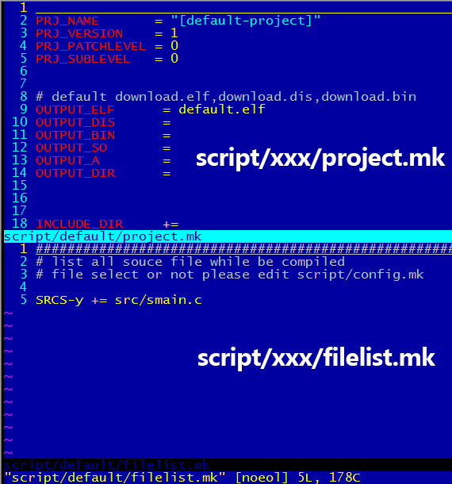

#MakeDoxygen
It's a project templet, include **Makefile temple** and **Doxygen templet**.

##How to use/怎么使用

* **make allclean**  

按照顺序清楚总工程下若干工程输出文件  


* **make alldisclean**

按照顺序清楚总工程下若干工程输出文件，删除那些由Makefile自动生成，并且是空的目录

* **make configure**

读取script/config.mk（格式如linux内核.config）生成总工程配置文件include/autoconfig.h

```
root@fnc:MakeDoxygen# make configure 
echo ./script/config.mk include/autoconfig.h "[default-project]"
./script/config.mk include/autoconfig.h [default-project]
read config file :./script/config.mk
make header file :include/autoconfig.h
```

* **make allp** make all project

“按照顺序”编译总工程下若干工程

```
root@fnc:MakeDoxygen# make allp
make DP=pi2
make[1]: Entering directory `/mnt/linuxProject/MakeDoxygen'
    ARCH       [x86]
    create     lib-x86/libla.so
    create     lib-x86/libla.a
make[1]: Leaving directory `/mnt/linuxProject/MakeDoxygen'
make DP=pi3
make[1]: Entering directory `/mnt/linuxProject/MakeDoxygen'
    ARCH       [x86]
    create     lib-x86/liblb.so
    create     lib-x86/liblb.a
make[1]: Leaving directory `/mnt/linuxProject/MakeDoxygen'
make DP=pi1
make[1]: Entering directory `/mnt/linuxProject/MakeDoxygen'
    ARCH       [x86]
    compile    src/smain.c
    create     release-x86/default.elf
    create     release-x86/download.bin
make[1]: Leaving directory `/mnt/linuxProject/MakeDoxygen'
```

* **make run** run default project output target

运行总工程下的默认输出文件，通常是*.elf

```
root@fnc:MakeDoxygen# make run
./release-x86/default.elf
Macro:
        PRJ_NAME      [default-project]
        PRJ_VERSION    1
        PRJ_PATCHLEVEL 0
        PRJ_SUBLEVEL   0
        BUILD_DATE    2015-12-01_16:19:25
asin(1) = 1.570796
test lafun1():  I'm fun1() from libla.so
test lafun2():  I'm fun2() from libla.so
test lbfun1():  I'm fun1() from liblb.so
```


* **make lp**

列出所有工程，其中DP指向默认工程配置目录
```
root@fnc:MakeDoxygen# make lp
        pi1=script/default
                pi1_arg=bin
        pi2=script/prj_liba
                pi2_arg=mlib
        pi3=script/prj_libb
                pi3_arg=mlib
DP=pi1
```

* **make ep DP=pixx**

编辑某工程目录下(script/xxx)两个配置脚本project.mk,filelist.mk



* **make gdb DP=pixx**

以gdb调试方式运行，条件需要在工程配置脚本打开 "-g" 选项

* **make gdb-core**

打开core输出文件调试程序

## 脚本编辑

Makefile基本可以作为一个通用模板，无特殊需要无需做修改。  
通常需要修改的脚本包括:


* [**script/common.mk** ](./script/README.md)  
* [**script/config.mk** ](./script/README.md)  
* [**script/listprj.mk** ](./script/README.md)  
* [**script/xxx/project.mk** ](./script/README.md)   
* [**script/xxx/filelist.mk** ](./script/README.md)   


##explain/解释
* make configure

默认执行 **mkheader ./script/.config include/autoconfig.h "[Project Name]"**

默认读取 **script/.config** 配置文件生成 **include/autoconfig.h** 头文件，最后一个参数是工程名，.config的格式与Linux Kernel 里的.config相同。转换过程需要工具 **mkheader**,该工具位于tool目录下，将其拷贝到cp ./tool/mkheader /bin/mkheader。

**获取 mkheader**

git clone https://github.com/MenglongWu/mkheader.git

** 运行实例 ** 

```
root@fnc:MakeDoxygen# make configure 
read config file :./script/./config
make header file :include/autoconfig.h
root@fnc:MakeDoxygen# ls ./include/
autoconfig.h
```

```
root@fnc:MakeDoxygen# cat script/.config 
CONFIG_KERNEL = y
# CONFIG_DEBUG = y
CONFIG_DEV_COUNT = 8
CONFIG_FILE_SYSTEM = n
CONFIG_NFS_PATH = "/mnt/nfs"

```

```
root@fnc:MakeDoxygen# cat include/autoconfig.h 
/*
 * Automatically generated C config: don't edit
 * Project "[Project Name]" Configuration
 * Depand on ./script/.config
 */
#ifndef _AUTO_CONFIG_H_
#define _AUTO_CONFIG_H_

#define CONFIG_KERNEL                                           1
#define CONFIG_DEV_COUNT                                        8
#define CONFIG_NFS_PATH                                         "/mnt/nfs"

#endif
```


* make all

生成 *.elf 目标文件

* make library

生成 *.so\*.a 目标文件

* make print_env


仅仅为了调试Makefile，输出各环境变量


```
root@fnc:MakeDoxygen# make print_env 
=========================================================
PRJ_VERSION   = 1.0.0
PRJ_NAME      = [Project Name]

file_common   = /mnt/linuxProject/MakeDoxygen/script/common.mk
file_prj      = /mnt/linuxProject/MakeDoxygen/script/project.mk
file_config   = ./script/.config
file_list     = /mnt/linuxProject/MakeDoxygen/script/filelist.mk
file_lds      = ========== no such file ./script/boot.lds

CROSS_COMPILE =
CC            = gcc
LD            = ld
OBJDUMP       = objdump
OBJCOPY       = objcopy

OUTPUT_ELF    = helloworld.elf
OUTPUT_DIS    = download.dis
OUTPUT_BIN    = download.bin
OUTPUT_SO     = download.so
OUTPUT_A      = download.a
OUTPUT_DIR    = release

INCLUDE_DIR   = -I./
LFLAGS        = -lm
LIB_DIR       = -L/usr/local/install/lib
CFLAGS        = -DTARGET_X86 -DBUILD_DATE="2015-10-19 15:09:22" -DPRJ_VERSION="1.0.0" -DPRJ_NAME="[Project Name]" -g -Wall -static -rdynamic
```

---

## Environment/环境变量
* file_prj - 定义工程配置文件，默认script/project.mk
* file_common - 定义公共环境变量文件，用于子工程里使用相同宏，包括CFLAGS，LDFLAGS等 

##Directory/目录结构
* doxygen - 
* dowx


##Context/联系
**Email:**MenglongWoo@aliyun.com

##Download/下载模板
git clone https://github.com/MenglongWu/MakeDoxygen.git


fsdf[sdf](operator)
[[]: operator](operator)
# []: operator
_jfl_jliw **dfe**
sd

## KnowBug/
gcc-4.3.2不支持带空格的宏，如下所示，更换 >4.4.1 版本gcc支持
```
Error
PRJ_NAME = "[Project Name]"
Replace
PRJ_NAME = "[Project-Name]"
```

 

[点击跳转](#KnowBug/)
