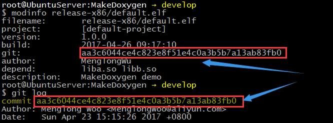

版本控制信息
============

  用户反馈产品有缺陷，对于数周发布一新版本的产品线，我怎么知道用户当前使用的是哪个版本，
  每个应用程序都有编号，编号与版本控制对应

  软件版本要素

  - 版本号
  - 编译时间
  - 版本散列值 __（本文介绍重点）__
  - 软件功能概要

  
 

# 1 基本版本信息
  除了版本散列值外，其余软件版本要素属于基本软件版本信息，它以宏为接口提供给
  应用程序，只需要在工程配置里定义他们，
  __ARCH、PRJ_VERSION、PRJ_PATCHLEVEL、PRJ_SUBLEVEL、PRJ_NAME__。

  如何配置参考：
  [《common.mk子工程公共配置》](./doc-common.md)
  [《project.mk 子工程特有配置》](./doc-project.md)  


# 2 Hash原理
  散列值(Hash)

  使用 SHA1 Hash 散列值区别软件版本，git版本控制每个节点版本节点都拥有一个sha1码，
  当然，对于不使用git作为版本控制的软件，本 __《版本控制信息》__ 不适用

  可能有人好奇，上图中已经拥有 __"version、build"__ 等描述版本，为什么还特意
  添加不易于阅读的 SHA1 值呢？

  对于已经发布的版本，以上两个信息作为一个规范的软件开发团队来说，应该能描述清楚软件
  版本，而产品在开发过程中，各人员之间相互交互个人模块代码，难免由于 __偷懒、遗忘__
  而导致 "version" 相同的软件，其实软件内容已经有改变。

## 2.1 依赖
  - git
  - script/gitsha1.sh
  - script/sha1dep.sh
  - .sha1
  
  每次make时候自动检测调用 script/gitsha1.sh和script/sha1dep.sh，若当前版本节点
  发生变化，则将节点值记录到 .sha1 中，

  定义 __宏 '_ _GIT_SHA1_ _'__ 使得C文件可获取 SHA1 值


# 3 使用方法

## 3.1 使能CONFIG_GIT_SHA1

```
Location:
  |     -> Project

         Select project (pi1=script/default)  ---> 
         Print level  --->                         
     [*] enable git sha1 node id                   
     [*] Support precompile                        
     [*]   add autoconfig.h.gch                    
     [ ]   add autoconfig++.h.gch              
```

## 3.2 定义

  在一个C文件里添加如下内容

```{c}

#include "proginfo.h"
PROG_GITSHA1(__GIT_SHA1__);
```

## 3.3 modules.dep

  保证存在文件： __/lib/modules/<'kernel version'>/modules.dep__  
  否则弹出警告

```
$ modinfo  a.out
modinfo: can't open '/lib/modules/xxxxxx/modules.dep': No such file or directory
```

  其中 __<'kernel version'>__ 可通过 __uname -r__ 查阅。  
  若没有执行脚本创建

```
# !/bin/sh
# the script only at first system run


# make director for 'modinfo' could be run
ver=$(uname -r)
mkdir /lib/modules/${ver} -p
echo > /lib/modules/${ver}/modules.dep

```

## 3.4 查阅

```
$ modinfo  a.out
git:            xxxxxxxxxxxxxxxxxxx
```


# 4 注意
  __.sha1__ 内容可能 __不是最新版本__，其原因有2：

  1. PROG_GITSHA1(__GIT_SHA1__); 所在的文件从上一版本开始未做修改，未被被重新编译，
  本版本使用老的 xxx.o 文件，解决方式对工程执行 __make clean 后重新编译__
  2. 源码并未提交到git， SHA1 值不变，具体流程如下

## 4.1 源码为提交导致SHA1值错误

  原始 .sha1内容为 __"aaaaa"__

```{c}
// main.c
#include "proginfo.h"
PROG_GITSHA1(__GIT_SHA1__);

int main(void)
{
  return 0;
}
```

  修改main.c，添加fun.c ，

  
```{c}
// main.c
#include "proginfo.h"
PROG_GITSHA1(__GIT_SHA1__);
int main(void)
{
  return fun();
}

// fun.c
int fun(void)
{
  return 1;
}
```
  
  千万别将该版本发布出去，此时的 .sha1 内容依旧是 __"aaaaa"__ ，git status 看到

```
      modified:   script/listprj.mk

Untracked files:
      fun.c
```

  必须完成如下过程后 .sha1 内容变成 __"bbbbb"__

```
$ git add main.c fun.c
$ git commit -m "xxxxx"
$ make clean
$ make all
```

  
## 4.2 正确习惯

  - 修改源码
  - git status 查看是否存在__modified__，
  检查是否需要提交 __Untracked files__ 部分文件
  - make clean 清理过程
  - make all 重新编译


# 5 测试
  - Ubuntu 10.10 modinfo V3.12 (module-init-tools) __(测试通过)__
  - Ubuntu 16 kmod V22 __(失败)__  

  实际上modinfo是kmod的软连接，它只能处理 *.ko 文件

```
$ modinfo release-x86/default.elf  
modinfo: ERROR: Module release-x86/default.elf   not found.

$ mv release-x86/default.elf   release-x86/default.ko
$ modinfo release-x86/default.ko
filename:       release-x86/default.elf
project:        [default-project]
version:        1.0.0
build:          2017-05-03_17:15:55
git:            4774f88533a6821683ac1723ff3d447b652c89fa
author:         MenglongWu
depend:         liba.so libb.so
description:    MakeDoxygen demo
```


  - busybox-1.23-2 需要添加补丁 __(测试通过)__

```{c}
--- a/modutils/modinfo.c
+++ b/modutils/modinfo.c
@@ -49,6 +49,9 @@ static void modinfo(const char *path, const char *version,
 {
        static const char *const shortcuts[] = {
                "filename",
+               "git",
+               "build",
+               "depend",
                "date",
                "license",
                "author",
```
