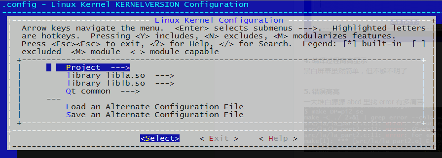

验证环境
===========

  首先尝试不做任何修改的情况下编译测试工程，如无任何错误才可根据需求修改模板。

# 1 测试menuconfig
  配置工程menuconfig保存默认配置直接退出保存，生成 
  __.config__、
  __include/autoconfig.h__、
  __include/autoconfig++.h__


```
$ make menuconfig
```



# 2 测试基础模板
  基础子工程包括pi1、pi2、pi3

  如何配置基础工程参考 [__《3min搭建Hello World》__](./simple-guide.md)

  - 子工程 pi1 生成 default.elf
  - 子工程 pi2 生成 libla.so
  - 子工程 pi3 生成 liblb.so

  编译正常表示MakeDoxygen基础功能可以使用。


```
$ make all
make DP=pi2 --no-print-directory
    ARCH       [x86] 
    precompile    include/autoconfig.h
    precompile    include/autoconfig++.hpp
    compile    src/la/la_part1.c 
    create     lib-x86/libla.so 
    create     lib-x86/libla.a 
make DP=pi3 --no-print-directory
    ARCH       [x86] 
    compile    src/lb/lb_part1.c 
    create     lib-x86/liblb.so 
    create     lib-x86/liblb.a 
make DP=pi1 --no-print-directory
    ARCH       [x86] 
    compile    src/smain.c 
    create     release-x86/default.elf 
```
<br><br><br>

  __如无特殊需求，后面两个测试可以不做。__

<br><br><br>
# 3 测试Qt环境

  对于需要做Qt的开发者，如果你对QT库熟悉，完全可以不安装庞大的 __Qt Creator__。  
  MakeDoxygen的扩展功能能够直接编译Qt源码。

  如何配置Qt环境参考 [__doc-rule.md__](./doc-rule.md)

  首先在make menuconfig中选择 __enable QT project demo__

```
  |   Location:
  |     -> Qt common
  |           [*] enable QT project demo
```

  在总工程里添加 __pi4、pi5__ 两子工程。

  - 子工程 pi4 生成 qt-hello.elf 
  - 子工程 pi5 生成 qt-moc.elf 

```
$ make all
/****************** 省略 ******************/
make DP=pi4 --no-print-directory
    ARCH       [x86] 
    precompile    src/qt/qt.hpp
In file included from /opt/EasyArm/qt/include/QtCore/qstring.h:1,
                 from /opt/EasyArm/qt/include/QtCore/../../src/corelib/kernel/qobject.h:48,
                 from /opt/EasyArm/qt/include/QtCore/qobject.h:1,
                 from /opt/EasyArm/qt/include/QtCore/../../src/corelib/animation/qabstractanimation.h:45,
                 from /opt/EasyArm/qt/include/QtCore/qabstractanimation.h:1,
                 from /opt/EasyArm/qt/include/QtCore/QtCore:3,
                 from /opt/EasyArm/qt/include/QtGui/QtGui:3,
                 from src/qt/qt.hpp:5:
    compile    src/qt/qt-hello.cpp 
    create     release-x86/qt-hello.elf 
make DP=pi5 --no-print-directory
    ARCH       [x86] 
    compile    src/qt/qt-moc.cpp 
    compile    src/qt/dlg-net.cpp 
    compile    src/qt/dlg-net.moc.cpp 
    create     release-x86/qt-moc.elf 
```

# 4 测试printl模块
  printl模块功能参考[__doc-printl.md__](./doc-printl.md)

  首先在make menuconfig中选择 __use printl __  

```
  |   Location:
  |     -> Project
  |       -> Print level
  |            [*] use printl  
```

  在总工程里添加 __pi6__ 两子工程。

  - 子工程 pi6 生成 t-printl.elf 

```
$ make all
/****************** 省略 ******************/
make DP=pi6 --no-print-directory
    ARCH       [x86] 
    precompile    include/printl.h
    precompile    src/printl/dev1-private.h
    precompile    src/printl/dev2-private.h
    compile    src/printl/t-printl.c 
    compile    src/printl/dev1.c 
    compile    src/printl/dev2.c 
    create     release-x86/t-printl.elf 
```
